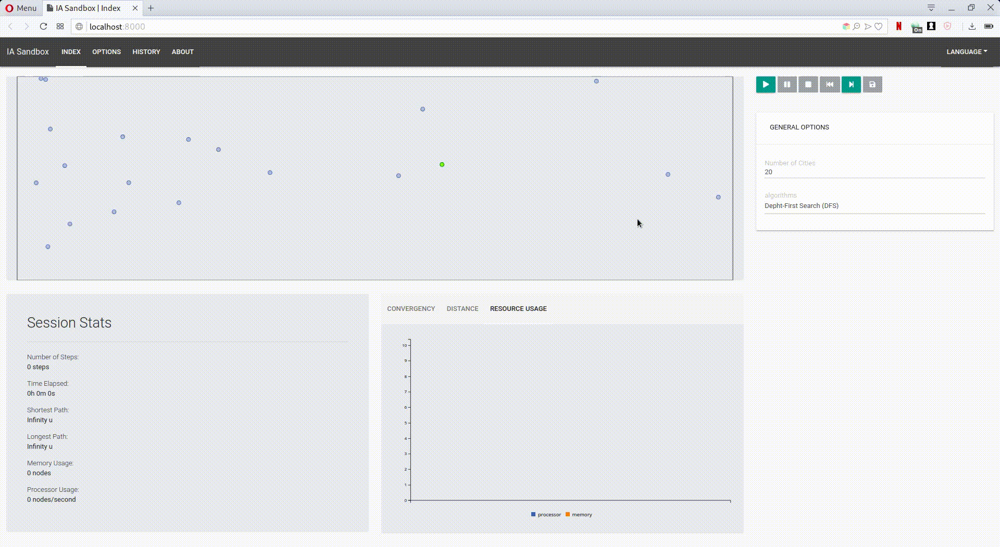

# Travelling Salesperson Sandbox

An AI Virtual Environment for testing algorithms with the Travelling Salesperson Problem.



## Quick Start

### Prerequisites

- Node.js 8.0+

### Installation
Use NPM to install dependencies
```bash
npm install
```

### Running
Use NPM to start the server

```bash
npm start
```

And acces it on http://localhost:8000

## Author
Vitor Bruno de Oliveira Barth - [vbob](http://github.com/vbob)

## License
This project is developed and mantained under the MIT license. 
